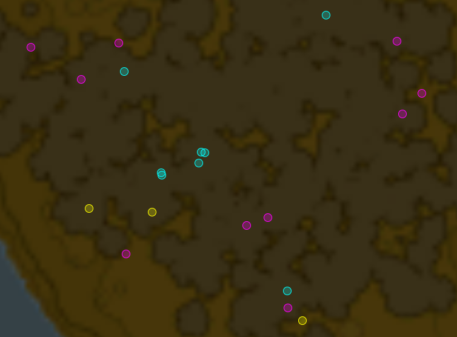
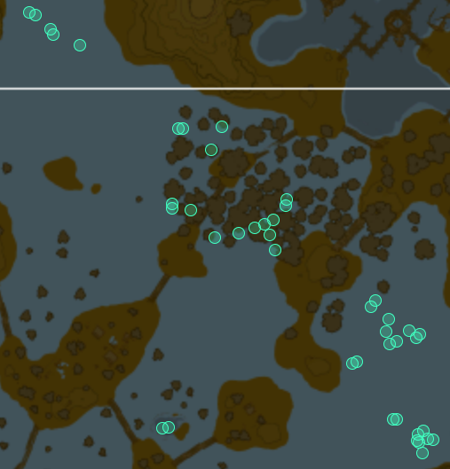
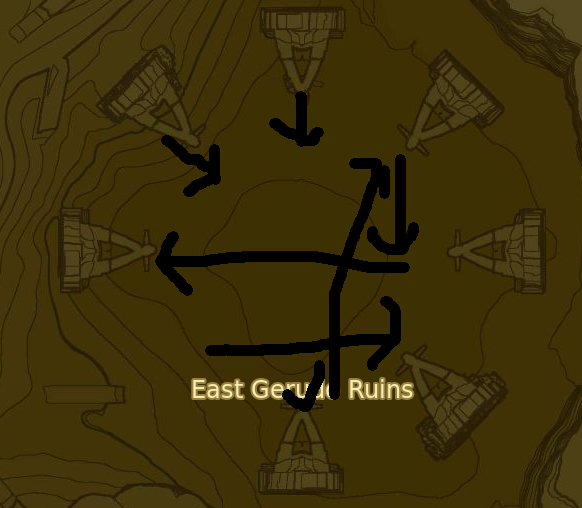

## Requirements:
- Finish all 120 main shrines and finish the "A gift from the monks" side quest
- Beat all 16 dlc shrines, get 4 extra spirit orbs, 3 medoh, 3 naboris, 3 ruta and 3 rudania orbs
- The illusionary blights are not required, same with the dlc dungeon

### Some order of events
- free all divine beasts and finish the main quests before champions ballad
- medoh before little bird kids (VOO LOTA)
- naboris before sand seal race (RAQA ZUNZO)
- talk to impa before farosh and the camera
- camera before guardian lady (SHOQA TATONE) broken twilight shield guy (KAH YAH)
- camera main quest, fairy fountain main quest, flown the coop and by fireflights light side quest before the second kakariko shrine (LAKNA ROKEE)
- Hyrule Castle before naydra spring (JITAN SA'MI) and eldra spring (TUTSUWA NIMA)
- farm farosh before spring (SHAE KATHA)

Base Route written by AceZephyr, extended by lepelog  
big shoutouts to the Breath of the Wild discord people <3

# Breath of the Wild Extended All Shrines No Amiibo (DLC 2):

TODO: Make the route better because it can probably be made better :)
TODO: gale and money management

START:
axe, rock lizard, zelda cutscene
hyrule herb, 5 arrows, boko shield, tower

fall damage cancel off, bomb shrine first if old route
(don't jump to cancel pulling out warp map animation)
Ancient part, DLC Ruby, magnesis
Underwater opal, 3xherb to the right, fire+ice arrows, Warp to SoR

3x shroom, 1-shroom cryo, warm doublet, amber in rock statue next to old man
surf to stasis, climb down ledge, sledgehammer, stasis shrine (get sledgehammer here also)
now either do bomb shrine launch or ToT launch
paraglider, bow, ragdoll reset, glide southeast, ground treelaunch to Ya Naga

5 YA NAGA: circle bomb in hole, climb on left side, walk forwards and detonate, glide through the hole in the ceiling

Climb wall behind shrine, south east iron chest launch to the south end of hylia bridge, tree boost in the direction of Pumaag Nitae, but grab knights claymore first

6 PUMAAG NITAE: Hide behind pillar, then surprise the guardian and kill it with Knights Claymore

run forward, tree boost to stable

7 KA'O MAKAGH: Open door, hammer breakable rocks, take door with magnesis, stasis hit, aim arrow and fly to the end

Tree carry from behind the shrine to the ancient saddle

Warp to Magnesis (Oman Au), box launch to horses, southeast to Bosh Kala

8 BOSH KALA: The trivial solution

Ride north northeast to Wahgo Katta stable, enter stable, Beedle:
SELL: 1 [all] Amber, 1 [all] Ruby, 1 [all] Opal; (300R)
Register horse (280R), wood axe, Wahgo Katta

9 WAHGO KATTA: Walk forwards, square bomb, circle bomb right on top of it, put a magnesis box slightly in front of that, climb on box, detonate circle bomb

North across Horwell Bridge, Eagle Bridge, glide to Hila Rao

10 HILA RAO: Cryo block jump left -> bomb boost for the fast strat

Left and behind you, shield jump over the outer ring of flowers, climb the rock, horse
North to forest (left of guardian statue), Big Hearty Radish x3 + Hearty Radish x6 + Endura Shroom x6



Kaya Wan:

11 KAYA WAN: idk just spam cryo

Stable
COOKING:
1 endura; repeat until empty
3 Big Radish, 1 Radish;
5 Radish;

Go to Beedle, BUY:
20 [all] Arrow, 1 [all] Arrow x5, 3 [all] Hot-Footed Frog; (100R)

Ride east following the path, then northeast hugging the mountain to your left to the shrine
Cryo across the lake, fire arrow the thorny things after 2 cryos

12 SHEH RATA: Glide down, cryo block jump up, magnesis the barrel to the switch

Glide and swim to horse, go right of ruins.
Seed collecting:
Forwards, 2x in grass, 2x slightly left, 1x slightly left, horse to trees
2x at trees start, 1x by tree forwards, magnesis chest to the right
Horse, ditch when you reach the wooden platforms, 1x back, 1x forwards behind tree, go left
6x in a line curving slightly left, go right, horse towards left of shrine for a small bit, get off
1x, forwards+left, 1x, a bit more left, mushroom behind tree, horse
go slightly left of the mound left of the shrine, grass, 9x in a very large cluster.



You should now have 27. (NOTE: Get probably more for the extra shrines)

Horse to left of mound, go to shrine and dodge the guardian

13 DAKA TUSS: Bomb strat, ragdoll reset, damage boost dive

Horse south to the last tree, tree carry launch, climb wall (use 1 stamina food), get sledgehammer
Climb gate thingy on left, wait for stamina, climb wall (use 1 stamina food), activate Ta'loh Naeg but don't actually do it

Glide to Impa's house, enter, talk again, etc..., exit, go slightly right and forwards, Goddess statue (3 stamina)
Backwards, left to cooking pot, COOK: Lizard, Ancient Part, Frog x3 for 5:10 speed elixr, endura shroom
Left, enter shop, buy 9 carrots (back right), exit, right, climb wall (stop at intermediate ledge twice), climb hill on top, glide to hill forwards, keep climbing up, magnesis chest for Phrenic Bow
Left, glide to trees, cut two trees and get wood, launch off third tree towards mountain, haste potion on land, climb up to boulders
glide to left hill, climb it, go forwards to end of hill, glide right, climb up (1 stamina food), run to Shee Vaneer

14 SHEE VANEER:

```
 4  O
O  5 
3O   
  2O 
 O  1
```

Throw 1 up-left, 2 back-left, 3 right, 4 back-left, 5 up-right;

Glide to Shee Venath

15 SHEE VENATH:
```
 O  5
4  O 
O3   
  O2 
 1  O
```
 
Throw 1 up-right, 2 back-right, 3 left, 4 up-right, 5 back-left;
 
Jump off to the right, enter Ree Dahee

16 REE DAHEE: Bomb boost over the gap, do the other two normally but stasis the final switch down and get the Climbing Hat and equip it

Warp to Shee Vaneer (the southern one), glide to boulders, boulder launch + arrow left of the mountains, land at the little cavern place with an unlit fire in it
Grab torch, 2x endura, flint, run up the path, 2x radish, 1x herb, 1x truffle, bomb the electric keese
Eternal flame, farosh farming (9 horns)
Glide left, climb second and third trees and get durians from them, cut first tree for 3 durians, go south southeast
Equip sledgehammer, throw after half a second of fast lightnings and enter Qukah Nata:

17 QUKAH NATA: (blessing) Get the chest (Rubber Pants)

Go west, glide towards waterfall (dequip sledgehammer) enter Shoda Sah:

18 SHODA SAH: Cryo, climb, go on railing, go forwards a bunch, cryo again, cryo boost bomb boost over the wall

Warp to cryo, chest launch to Rota Ooh

19 ROTA OOH: left side of the giant rotating thing, shoot arrow at switch while sidewalking into it, shoot it again and hold left while it spins, finish the shrine

Axe by fallen trees, COOK: (Endura x1)xAll, radish x2 + truffle + durian, (durian x4), (3x seed + carrot + shard)x9;
Get horse, EQUIP ANCIENT SADDLE by the lady feeding the deamons, ride north to Gleeok Bridge, Kaam Yatak

20 KAAM YA'TAK: Use speed food, Bomb boost, shoot rope (pick up arrow), Edge of Duality chest, up stairs to big door, throw axe, magnesis it into the door

East, magnesis chest at very right of ruins by a decaying guardian (Phantom Pants)
Go towards Hyrule Castle to some very big flags, Big Radish
magnesis chest in the water (Phantom Shirt)
Horse, west, dodge the guardians and get to Katah Chuki

21 KATAH CHUKI: Use Guardian Sword, don't get spear, don't get chest

Horse, west, cross the river, left side of brambles, throw bomb at wall, glide from above

22 NOYA NEHA: Throw sword at it, Edge of Duality spins, get axe and chest

Use one iron box to get out, launch with other box to Zalta Wa, whistle for the horse

23 ZALTA WA: Run forwards, swing at switch, paraglider at peak of boost, hold up, finish the shrine

Keep going west, after exiting the cave thingy go south to Sheem Dagoze puzzle
Shoot arrow from far right (crouch, aim 1 cursor above the hole), take horse to shrine

24 SHEEM DAGOZE: Bomb High Jump over the gate

Ride northeast, then northwest towards the path, and towards Tabantha Stable
Climb to Shae Loya

25 SHAE LOYA: Freeze the ball, two arrows, unfreeze, shoot the high switch, beat the shrine

Glide to behind stable, get wood from cart, wood from pile to the right, talk to Toren for money
Beedle, BUY: 20 [all] arrow, 1 [all] arrow x10; get woodcutter's axe outside

Tree carry up the hill, then tree launch to the thunder plateau, to the Orange Orb

Launch ball to center (red), switch to non-lightning stuff, glide left and run to left of red ball
Drop knight's shield, rainclimb, flameblade launch red ball to center
Run to and climb to center, put balls in holes, go behind green ball, shoot two arrows at it
Grab rusty claymore, unequip, put green ball in hole, shrine

26 TOH YAHSA: Bomb squares, drop down, bomb hole in wall, put square bomb in behind metal block
Chest, Climb small ledge, magenesis box onto bomb, jump onto it
Stasis, 3x rusty claymore JS, bomb, unstasis, glide to exit

Warp to Shee Vaneer
Glide left to Farosh's Spring, dump a Farosh Scale in it

27 SHAE KATHA: (blessing) Chest

Warp to Ta'loh Naeg, go right to fairy fountain, catch 3 fairies, endura carrots behind fairy, climb wall
Run right, treelaunch northeast, get a stag from behind the trees and bring it to the platform

28 MEZZA LO: Climb up ramp, throw square bomb, magnesis box on top of it, stasis it, 2 jumpslashes, detonate, unstasis it

Air tree launch right of the tower mountain, curve it slightly left after the mountain, Big Radish right of shrine.

29 SOH KOFI: EoD spins, don't get its stuff, chest

Run right then northeast, treelaunch w/ woodaxe north northeast

30 TAH MUHL: The easiest shrine. Bomb the leaves, and jump on and off of the slope and you're done lol

Forwards, left onto the lower ledge, glide forwards then left (northeast), run up the grassy hill to Foothill Stable
Right from stable, up a rock, enter shrine

31 MO'A KEET: Run up the first ramp and stasis the ball as it comes out, unstasis it before you get to the top
Stasis the ball as it falls out of the second ramp's hole, then run up

Right, glide to right of the stable, cut down the tree facing north with woodaxe, throw it, get double axe from the left, then stasis and launch north with hammer

32 SAH DAHAJ: Bomb the leaves, ignore the guardian, climb the ladder, bomb the leaves
Switch bombs, throw at caged wall in front of the boxes

Run left, glide, climb the rocks going right (east), go over the ledge, call horse and enter Ze Kasho

33 ZE KASHO: Apparatus down slightly, shieldjump onto floor, hit switch, run through laser maze
Apparatus down+left, bomb high jump over wall, climb the down and right walls and jump to the end

Ride right, ragdoll reset, run along path until stone structure, big radish x2, keep climbing up to some trees at the top, launch east but right of the giant thing on the left, curve left after it, call horse there too

34 DAN HESHO: More EoD spins, throw iron sledgehammer, get its axe, chest

Ride south and slightly east, `get two herbs from bushes before the path`, and dodge the fire arrow guys
Hearty truffles at the trees, glide down, glide down again and break the rocks with a sledgehammer jumpslash

35 KE'NAI SHAKAH: Guardian axe x2 spins (throw when they get damaged), thunderspear it if it begins to spin, finish with EoD if needed, loot weapons, chest

Glide left, updraft up, get on the high ledge, herb, woodaxe treelaunch north northeast, do a few spins on the slab over the shrine

36 KAH MAEL: shoot closer front rope, get on platform and shoot the farther one, glide to finish

Climb up, go left and back, run around until you get to trees, woodaxe launch off of rightmost tree to where the ball is
Launch ball completely from shallow water, cryo chain across, go left to the path through the water and enter the shrine

37 RITAAG ZUMZO: (blessing) chest

Go northwest, cryo chain to land, call horse and ride to Katosa Aug

38 KATOSA AUG: Run+jump+glide off of platform apparatus is on, bomb boost to end

Take horse, follow path north and don't get guardian'd, go to north tree and launch north to labrynth
Enter at front of back section, rightmost section of left half, glide to land on the right
Up stairs, fire arrow vines to the right, climb and get Great Flameblade (may have to throw axe)
also throw a sledgehammer
Return, keep going right, get torch at shrine

39 TU KA'LOH: (blessing) chest

Fall down updraft, go forwards and get Travel Medallion, warp to Shae Loya

Double axe + sledgehammer treelaunch northwest, break leftmost rocks and loot rocks underneath
Get to trees atop plateau, set fire and wait for noon
Treelaunch northwest

40 BAREEDA NAAG: Climb cannon, get on top of right 'horn' and run and jump and bomb boost

Left, arrow treelaunch carry to Akh Va'quot

41 AKH VA'QUOT: Shoot at the right three, then the middle one, then 3-hit the left two with hammer

Run across bridge, go left and climb wall, talk to Elder
talk to the bird to the right of elder [cutscene]
Jump right, glide back-right to goddess statue. Get Stamina xAll
Go right, 3rd shop, SELL: All Sapphire, 1 [All] Opal, 2 [All] Giant Ancient Core, (menu left)
Climber's Bandana, Rubber Tights;
BUY: Snowhat; equip snowhat
Go left 1 shop, BUY: All bom arrows, All arrows;
Jump off right, double axe -> sledgehammer + axe treelaunch to Sha Warvo

42 SHA WARVO: just keep gliding just keep gliding

Run forwards, glide across flight range, small shield surf -> glide, fall down and enter gap, fall down,
Go through water, enter shrine

43 MAKA RAH: Aim slightly left and bomb arrow, shield surf jump over spikes, switch
Left, cryo up to switch, second switch, get other chest (Bomb Arrow x10), run up the slant
Immediately stasis or magnesis the spiky ball of death, run through

Warp to Sha Warvo, run and glide to takeoff point, 10 arrows
Shoot the targets (in front, look left, look left, look left, look right)
Get bow chest and equip it, bomb the entrance to Medoh

VAH MEDOH: Glide left, shoot switch and malice eye, climb up slope and glide to terminal
Jump out of hole, shoot malice on fan, glide up and to other entrance
Glide down to terminal below, jump off and jumpslash
Jump out, fan up and under head, shoot malice from ground, fan glide to other side
Shoot switch through grated wall and malice above, terminal
Slash the ice arrow chest, stasis the pusher, four hits, magnesis pull the turbine, run to gate
Terminal, backwards and out hole, fan up to control terminal

WINDBLIGHT: 
Phase 1: Equip attack shirt and hat, fan up, spam bomb arrows on eye
Phase 2: wait for a teleport, do the exact same thing
Heart container, gtfo

Go right, 2nd tent, get the god bow, jump off right, run to shrine
Tree launch east (freeze tree as it hits ground), set travel medallion, warp to Medoh
Forwards, jump off to intermediate ledge, talk to red bird, fall to bottom shop
Talk to blue bird, left, jump off after first tent, glide down to lake
Bomb the lake, get 2 Hearty Salmon, talk to yellow bird
Forwards, gale(2) towards main village, go to tent under takeoff point
COOK: 
Salmon x1 + Butter x1 + Wheat x1, (Salmon x1 + Big Radish x2 + Truffle x1) x2, (Carrot x1) x2;
Talk to green bird, warp to Travel Medallion
Chuck double axe, talk to purple bird
Look towards city, blow, move two right after each blow
Cutscene, drop korok leaf FROM INVENTORY, grab double axe, enter shrine

44 VOO LOTA: Climb ladder, hit switch, glide to back right, chest for key, glide to center

Warp to Akh Va'quot, tree launch from behind to the east (freeze tree as it hits the ground), land at forest before slopes
radish + shroom, tree launch carry northeast, glide to intermediate ledge, gale(1)
Run east to water, gale(0), glide to island with dead tree, high tree launch carry northeast
Go right around mound, swim in and eat extreme health bonus food, enter shrine

45 LANNO KOOH: (blessing) chest

Hit right skeleton w/ hammer, grab its sword, Vark strats or cryoswim to escape going right, shield surf towards tower
Equip claymore, climb up to tree, launch south southeast, hammer JS shrine entrance

46 MAAG NO'RAH: (blessing) chest

Exit hole, drop down, call horse, ride to the total obvious shrine

47 MONYA TOMA: Grab ball, go to the right side of the gate, face away from gate
X, at peak of jump A then Y

Run left to rocks, smash left front rock for luminous stone, run around to Hyrule Castle, small shield surf going east southeast,
At last set of trees tree launch, then tree launch into Hyrule Castle

in the docks, throw claymore, get fireblade
Run up stairs, fire arrow the big torch at the top, enter shrine

48 SAAS KO'SAH: guardian axe+ spins, throw, shock arrow, guardian sword, shock arrow, throw sword when done
sword++ and axe++, no chest

run out of the docks, gale(2) up right, get dinraals scale, gale(1), gale(0), stasis + 3 hit thing above naydras scale away, get chest, launch left of korok forest, call horse and ride up hill to the trees around the korok, launch to the left side of the vulcano into korok forrest, put rusty shield in tree, throw chest to the other side in the water, cryo to the other side, put chest in mouth and enter the shrine

49 KUHN SIDAJJ: (blessing) no chest

run and void out, then run left to the lost pilgrimage, talk to korok, go right a bit, bomb arrow and forwards
land, go through log on left, then right, then path to shrine I guess or try risky tree strat

50 DAAG CHOKAH: (blessing) no chest

run and void out again, run to Keo Ruug and pick up the endura shrooms

51 KEO RUUG: Left, first ball goes in back left, second goes in front middle, go around back, third goes to front left, fourth goes to back left middle or just do the bomb boost over it

```
XX OX
XX XO
XO XX
XX XX
OX XX
```

Left, climb rock, left at path, talk to quest korok
Equip bomb arrows, go right around rock, bomb arrow the boxes, glide up
Go slightly left, forwards, bomb arrow to updraft before swamp, glide to shrine

52 MAAG HALAN: (blessing) no chest

Warp to Shee Vaneer glide back-right to boulders, launch right into gap where shrine is
Hammer JS to enter shrine

53 TOTO SAH: Apparatus down, next apparatus right and twist right, glide to midsection
Bomb off right edge, explode it kinda fast i think idk, glide to end

Falcon bow, bomb arrows, stasis
Swim forwards across ledge, run to forwards left tree, flameblade 1+hammer treelaunch to shrine
possibly cryo jump over brambles

54 HA DAHAMAR: Cryo the right side of the water walls, mash stasis on hole opening
Shoot above+left of ball, release stasis, run to door

Run to right of stable, fire until night
Call horse, go north then right around the stable, aim left of the tower, go through the gate
Approx. follow the path, go on left path, jump off horse and midair shoot th glowing head

55 KAM UROG: Run and glide forwards, ride left thing up, stasis middle gear when nearly level, run to other side, climb gear up to top

Left, climb wall, gale(2) from intermediate ledge, hammer rock for gems, climb up, gale(1) right, gale(0) up again
Run forwards, climb, forwards, jump down and a bit left and glide into the hole, run left

56 DOW NA'EG: Glide to huge switch, left cryo shield jump -> bomb boost

Warp to Kam Urog
Horse forwards, then left, path, take the bridge of faith, path, right at the fork
Left in the water, go right of the hinox, climb tree, glide and grab ball, go back-right
Walk up the path, ball in hole, go right, EoD spins (it should now break)
Ball, go back to hole and put it there
Right, glide to ball, go back again, hole

57 TAWA JINN: (blessing) chest

Right and back around shrine, glide left of middle kin, launch off of tree left of 3rd left bone south southeast with thunderblade to Yah Rin

58 YAH RIN: Magnesis block on square bomb, stasis 3 hit explode forwards elevator launch, glide after a bit after the launch, run to the end

Left and back, carry east northeast from back tree
Right, up green hill, call horse and ride to the shrine

59 MUWO JEEM: guardian sword++, dodge first swing, 3 hits flurry, keep slashing it, throw sword to finish him, get shield and axe

Thunderblade treelaunch east, aim slightly left of death mountain then left to rocks, gale x2(1), glide northeast, Hateno, shrine

60 MYAHM AGANA: Apparatus flip and upside down puzzle solve

Go slightly right, forwards then right, cross river then gale(0) then aim towards flame, light torch
Throw it across river, throw it up hills, just keep throwing it
Throw it at the furnace, talk to Purah, get slated, photo her, talk
Exit, righ to tree, thunderblade + sledgehammer launch northeast, doublet + snowhat
Keep running forwards, at the drop glide forwards then fall, hit rock and enter shrine

61 TAHNO O'AH: (blessing) chest

Thunderblade tree carry left, let go at apex and glide left, run forwards and run up slant
At descent, pass one tree then carry right from back of two trees
Run and climb up the pillars until you get a cutscene
Throw scale in water, enter shrine

62 JITAN SA'MI: (blessing) no chest

Go left then left again, glide off to far trees, launch forwards with flameblade and hammer
Aim slightly left of the two parallel wind gusts at other gust left of those, drop down
Bomb arrow (or bomb if raining) the rock, ride gust right, bomb arrow right (or climb wall and bomb from above and behind with gust
Left, do the same, forwards and get gusted to platform, enter shrine

63 SHAI YOTA: (blessing) chest

# Check Blood moon!!!

Warp to Ta'loh Naeg and finally do the shrine

64 TA'LOH NAEG: Right chest, use wood axe in fights and be bored until tutorials finish, get chest

Run to the fairy fountain and get fairies and free the fairy from its curse of poverty
Photo the fountain, run back
Jump over the hill to the left at the end, grab chicken, glide to guy in front of pen
talk to guy in front of pen, put chicken in pen
Run back next to fire to guy, talk again after he runs and show picture
Grab chicken by fire and bring to pen, go right and climb house return chicken
same direction, keep going past fire to chicken, return, back that way past fire
Fireflies by tree (jump, grab, glide, grab, go left and mash grab) climb up left ledge
(make sure you have 5), chicken, return it
Other direction, keep going left across bridge, left into tiny tree area, chicken, return
return across bridge, keep going and get chicken and return
throw in, after it lands talk to guy, run right to fireflies and beyond, enter house
talk to person, talk again, drop 5 fireflies
Left, glide down to fire and go up to impa's house, talk to Paya
Exit, glide to fire, rest until night, equip attack armor
Run over behind a tree next to the pedestal. You have four minutes to do things that aren't BotW.

Firesword slash x2, spin
ball in hole, shrine

65 LANKA ROKEE: (blessing) chest

Warp to Sheem Dagoze
Left, gale(2) at edge and climb up, forwards, climb, forwards, gale(1), climb, gale(0), go a bit left at this gale
Dead tree, midair freeze tree launch, launch forwards towards trees, get hearty durians by climbing trees and getting them
go slightly right, enter shrine

66 MOGG LATAN: glide to left, jump up, shoot ropes
Stasis thing that fell, hit a bunch get on, drop bomb off and detonate, get flung up and glide past everything
except for the end thing, bomb and magnesis the door open

Go right, launch to the right of the blood moon shrine platform, place Travel Medallion on landing?

Warp to Cryo
Go right, glide off mountain, surf down and jump, glide to shrine below the bridge

67 DAH KASO: EoD spins, no chest

Gale(2) up, call horse, ride past the hinox, ride forwards then right, jump off to shrine
Get ready for the two hour gerudo section. Mentally. You will need it.

68 JEE NOH: Shoot the ball, reflect the guardian and shoot the ball, stasis tlaunch the ball (3 hits), shield jump over first laser, stasis second, shield jump over third, ball in hole

Glide to horse, keep on pathing (rip 300R here), get rare ore
if you don't have lots of yellow hearts eat food that gives you lots of yellow hearts
Climb up, gale(1) up, go right, run left to the CONTEST OF ENDURANCE!!!!!!!!!!!!!!!!!!!!!!!!!!!!!!
Equip flameblade during first trial because YOU'RE A REAL MAN AND YOU CAN TAKE THE HEAT!!!!!!!!
Spin cancels when you catch fire because OUCH YOU'RE ON FIRE AND THAT'S TOO HOT FOR A REAL MAN!

69 JOLOO NAH: Shoot the center front thingy, apparatus diagonally, shield jump right
Stand on and stasis switch, run through gate
Apparatus diagonal, bomb arrow all the unlit torches

run right drop down to horse, ride the way, stasis hit away the rocks

70 KAY NOH: Shoot right thing, push against door, stasis left block 1 hit release, climb it, key
Return, open door, ignore guardian, connect right side boxes

Go right, gale(0) and climb a lot forwards, magnesis box to right side, arrow box launch, drop onto Dako Tah

71 DAKO TAH: Up stairs, jump onto railing, shield jump onto platform, get onto platform
Bomb arrow left side of wall that's in the hole in the ceiling in front of you
Grab powerbox, get on elevator, up ramp, up another ramp, magnesis the box up to the top
Elevator up, get on lateralvator, magnesis the thing in front of you to be further away
and finish the shrine

Glide right, seal, surf to Gerudo Town, talk to guy, enter shrine

72 DAQO CHISAY: grab box from left, put on middle area, stab with thunderspear

Surf slightly right, equip flameblade at night, get to the town, cutscene
Double axe, gale up to clothes salesperson, become KAWAII

Warp to Daqo Chisay
Surf left, talk to person running left for snowboots, enter the town
Shop on right, BUY: [all] Hearty Durian;
SELL: Gems, Rubber Armor, Climbing Boots;
Go left to arrow shop
BUY: [all] Fire Arrow, 3 Shock Arrow, 1 or 2 Bomb Arrow depending on money;
Run to Riju, cutscene, go right, talk to army leader, run out and left, buy sand seal
Slight turn right, head to the divot in the ground, follow path
After second boulders spawn, make fire, wait until noon
Gale, keep going forwards, climb up a bit, gale up right, place luminous stone on pedistal

73 SHO DANTU: Flameblade left blocks, bomb arrow middle of cage, same thing on the right
Throw square bomb on back left launcher, stand left of door, bomb arrow middle up thingy
Detonate as bomb flies by middle

turn right, climb wall, forwards for a bit, climb up (use a stamina food), run slightly right, glide right of tower
then to pedistal, it should be a bit before 2:55, equip attack armor
at 2:55 shoot the sun and KILL THAT STUPID SKYCIRCLE

74 SASA KAI: Guardian Axe+ spins, throw it, ignore chest

Loloup got a 5:08:02 Sasa Kai split, and he didn't get a blood moon for at least two minutes. In a previous run, he did get blood moon with a __5:17:39__. Considering it's currently 3PM, it would probably be a better idea than anything to push the blood moon shrine back from its current position.

Warp to Sho Dantu, run left and to Hideout
Light arrow and shoot front-right thing, chuck soldier bow and grab duplex bow
Enter hideout, glide, climb block left, glide above and behind guy in front of door
No bananas i guess, bomb arrow and EoD spin Koga, and magnesis the balls into him
THUNDERHELM!
Run around hole, equip doublet, snowboots, snowhat, climb walls at the back, go right
go up some rocks, find the ice, fifteen fire arrows on it with eagle bow

75 KUH TAKKAR: Stasis ice block, throw bomb at it, unstasis, climb stairs
Icelaunch (backup: elevator launch with mag block in lava)

[8PM] Go right for a while until rock platforms on right side, go past them and gale, grab forwards wall, gale and go right, keep going
Box launch forwards, shock arrow the thing on the wall [10PM]

76 KEEHA YOOG: (blessing) chest

If you currently have a blood moon, warp to travel medallion. Otherwise keep going.

Go right, double axe airfreeze treelaunch north (left of the updraft) (figure out where to waste a gale before here)
Land on a column, __photo a guardian skywatcher__, go right, equip attack armor, enter shrine

77 TENA KO'SAH: __photo the guardian__, Guardian Axe++ spins, shock arrows, guardian sword after axe breaks
loot weapons, no chest

Run forwards, glide down to tree, loglaunch to shrine, stasis platform off it

78 KAH OKEO: Chest, wind turbine while on door, wind turbine 2, stasis platform, bomb arrow and bomb it
Glide forwards and left, and beat the shrine

If you haven't gotten blood moon yet, warp to travel medallion, make fire, and make it night.

79 MIJAH ROKEE: Guardian Axe++ spins, shield, no chest

Warp to Daqo Chisay, gerudo clothes, jump over wall and into town, climb up, riju
Glide left to seals, but get iron sledgehammer first,
Seal to tower, equip duplex bow and bomb arrows and firesword if night and not, begin nabooris quest

Bomb the feet!

VAH NABOORIS:
new route with 3 gales(0), attack armor, bow, bomb arrows, guardian shield

THUNDERBLIGHT:
Equip Guardian Sword, shield attack, do slash, spin, midair spam bomb arrows w/ god bow
Magnesis the thing into him, midair spam bomb arrows again
Heart cuz why not, re equip gerudo clothes, run to riju and finish the main quest

Left, bomb a seal, keep going that way, go around town (if it becomes night, equip flameblade), go to race
Start race, do race, win race, ball in hole

80 RAQA ZUNZO: (blessing) no chest

Launch from right tree next to people, go southeast
Set Travel Medallion, talk to gerudo person annoyingly preventing us from entering the shrine :(
Warp to Daqo Chisay, cut a tree in the village with flame weapon, wait until noon, go right and into the bar, talk to her
Left, climb wall to get out, glide forwards-left, shieldsurf after a bit
run through ruins to the other side, duplex bow and ice arrow, enter freezer
Stasis launch the icecube to the end (watch vark's run now), use bow to freeze enemies if needed
Warp to Travel Medallion, talk to her, enter shrine

81 MISAE SUMA: (blessing) chest

Warp to Keeha Yoog
right, cold gear, gale, gale, gale(0), treelaunch slightly right with flameblade, curve left around cliff, glide to shrine

82 KEMA KOSASSA: Attack armor, guardian axe++ spins and shock arrows,  throw almost broken flameblade if you have one, EoD spins after axe breaks, guardian sword after EoD breaks, grab axe, no chest

warp to Vah Nabooris
Glide left, fall onto right statue with ball on top, mag it forwards near own hole
Left 1 statue, put into hole 1 left of it
left of that hole goes to front right
Front of front right goes to left left
Front of front left goes to back middle
Next to right right statue goes to right right



83 KORSH O'HU: (blessing) no chest

Warp to Mezza Lo
Launch southwest to ledge, run forwards then right, herb, run forwards until there's a green bit in front of you but there's a gap
get over the gap, tree launch towards Zora's Domain from there

Talk to king zora and don't fall asleep, equip zora armor, run down to Sidon for more exiting dialogue  
Right to cooking pot  
COOK: (Durian x5) x2, Big Radish x2 + Radish x2 + Truffle  
Run around back of shrine, get Silver Longsword, enter shrine

84 NE'EZ YOHMA: cryo after one ball, stasis ball and launch into hole, stasis spin ball, elevator off it and glide to win

Jump down in water, go up the waterfall, run and treelaunch to Sidon, fight with RUTA (onecycle?)

VAH RUTA, gale x3(0)

WATERBLIGHT, miphas grace and finish the main quest

Left, west zora bridge, cryonis from there near trident, down, magnesis trident up (make sure to have a weapon slot left), backflip into bullet time to waste all stamina, run west to pond, cryo, paraglider and jumpstab onto pedestal

85 DAGAH KEEK: (blessing) toss trident, no chest

Warp to Quaka Nata

Left, drop down to call horse, ride carfully forwards to lakeside stable because horses are dumb, bomb wall for Shai Utoh

86 SHAI UTOH: Stasis first thing, quickly unstasis, flip second thing, stasis climb unstasis, flip third thing, stasis climb run across unstable final bridge

Warp to Muwo Jeem
Go backwards to tree, flamesword + hammer launch to Eventide
Land at boko/electro chu hill, bomb chus, bomb iron crates, jumb glide to hinox, get club and ball, run back up put ball in, gale(2) to higher hill, stasis + 5 hit the slab away, grab ball and put in, ignore enemies, run down to last ball and run across the island to put it in

Run to center of island, grab big radish and truffle, glide to treefort left, gale(1)
gale(0), enter shrine

87 KORGU CHIDEH: (blessing) no chest

Warp to Muwo Jeem
Right, glide to tip of land tail but stay in water, photo ruin, run out of stamina in water
Fall down, glide right at the bottom, photo second ruin, left, radish, shieldsurf, 3rd relic, run back and talk to guy
Talk again, crouch on right platform, enter shrine

88 KAH YAH: Left, grab barrel, stasis launch off boulder into end, or just stasis the final switch and return

Warp to Muwo Jeem, launch southeast, land on shrine, enter

89 CHAAS QETA: Guardian Axe+ spins, get axe++, no chest

Warp to Kaya Wan
Get horse, ride towards death mountain, then path until a downhill and a split left
run northwest, glide to and climb wall

90 NAMIKA OZZ: Sword flurry, shock, hits, no chest

Climb right, glide down to stable, __talk to Beedle for ancient arrow__ run around water to shrine

91 MIRRO SHAZ: Longsword 5 hits (not red) on ball, a few hits on other thing

Go right, gale(2), run up path, after sharp left climb right and run straight, glide down and run forwards-left
Soon you'll be on fire, spin burn cancel, gale(1), glide to shrine, take a fairy

92 QUA RAYM: Shoot right thing, break left box, glide across and bomb boost

Right, square bomb, magnesis box on it, elevator-ish launch, eat food, run to hot spring, gale(0), 
forwards then right, jump on rocks to the left, glide, run to other side of rock and place travel medallion
go left, boulder launch right, glide down to Daqa Koh, enter

93 DAQA KOH: Jump in the middle, glide in midair, go on middle, stasis middle when it's at the top, glide to end

Go right onto small peak, glide right and eat food, climb rock face, glide to back-left of goron city, land at shop
SELL: 2x Diamond; exit menu, BUY: Flamebreaker shirt, Flamebreaker boots
Forwards bridge, left, house to the left, talk to Goron, go left, talk to goron elder, path to Shae Mo'sah

94 SHAE MO'SAH: boost up, stasis switch, finish

Right, glide and use canons to free our favourite goron boi, glide down to shrine

95 SHORA HAH: choose your strat

Jump right, spam jump left when on the wall (use 1 food), climb on top of this whole thing, get korok rock
Backflip rock launch, glide to a tree idk where, treelaunch to darkness

Launch past torch and past pedestal, run to torch with hinox with ball, bring the ball to the shrine

96 KETOH WAWAI: (blessing) no chest

Warp to Daqa Koh, help yunobo with urbosa, escort

VAH RUDANIA gale x1(2)

FIREBLIGHT, heart container, finish the main quest but avoid yunobos text trigger, get weapon

Warp to Katosa Aug
Horse, ride right east downhill to spring, toss in Dinraal's Scale

97 TUTSUWA NIMA: Guardian axe++ spins, shock arrow, get sword and shield, no chest

Right, climb up out of spring and to horse, north then northwest (follow the hole on the left) and gale(1) and glide to the shrine

98 ZUNA KAI: (blessing) no chest

gale(0) right, get back to horse, ride northwest then west around the lake
when you get to the rock ground go left, then right, then follow path to red archway
updraft up, talk to annoying goron

Gut check: glide up to first intermediate, climb to first wood platform with a red, get to second
get three for the final climb, enter shrine

99 GORAE TORR: (blessing) we're finally getting a chest!

Warp to SoR to start the champions ballad, grab obliterator, glide down to enemy base, kill bow boko with obliterator, shoot a keese, climb tree, kill boko grab shock arrow, maybe bow?, jump down kill enemies with arrows, grab bomb arrow chest

100 YOWAKA ITA SHRINE: run down, magnesis bowl, transport little bowl to link, grab, run up and put in hole

warp to cyronis, eqip some cold protection, surf down, climb a little bit, shoot wizzrobe with fire arrow, kill moblins with obliterator (grab ice arrows) and ice lizalfos with fire arrows, surf to shrine

101 ETSU KORIMA SHRINE: run, pass the lasers with shielding them, just run to the end without getting hit by the small guardians

left run and glide to enemies, kill fire lizalfos with ice arrows, other enemies with arrows too?, grab arrow chest

102 RUVO KORBA SHRINE: kill guardian with obliterator, grab bomb arrows, activate switch, run fall down, cryonis jump to small key chest, open door, shoot guardians in front of you with arrows, left and right one with bomb arrows, jump to end from cryonis block

run forward to the next enemy base, fight and run to shrine (TODO: figure out strats)

103 ROHTA CHIGAH SHRINE: jump on iron plate, jump to cube when the plate is not moving, shield jump over, dodge spike balls, maybe stasis one, run on the left side for all but the last spike trap

Warp to Ruta, run right and lauch with a rock to the ruta pillars, run down and glide to shrine

104 RUCCO MAAG: Cryo in water, cryoboost bombboost over wall

Warp to Ne'ez Yohma: Jump into Water, go up the waterfall and land on the bridge to run to the rings, go and fly through them to the next shrine

105 MAH ELIYA: TODO

right, treelaunch to guardians, stun one of the skywatchers to kill 3 with urbosa, kill last one with ancient arrow

106 SATO KODA: TODO

warp to Kah Mael, campfire until morning, glide down to the ring, campfire until noon

107 KEE DAFUNIA: TODO

warp to shrine near Goron city (Shae Moh'sa): Build cheat machine to fly to daruk pillars, the fly north to the Mega Magmarok, kill it with daruks weapon

108 KAMIA OMUNA SHRINE: Bomb-arrow the targets with long range bow

Warp to Vah Rudania, go through the rings, use one gale(2) and fly down to the shrine

109 SHARO LUN SHRINE: run, grab moving thing, avoid flames, jump over the last flames and run to next moving thing, shoot guardian, jump glide to 2nd guardian platform, jump to next thing, cimb up fast, run to next thing, double cryonis to get up, another cryo to get chest with flameblade, jump to next moving thing, cryo your way up

Warp to Travel Medallion

Left, into cave, talk to goron, run out and down the ramp, grab the rock sirloin and walk back up, dodge things

110 KAYRA MAH: Take the left side of the middle path

Wait until noon at cook place, run out of the cave, climb back hill, run to the lava lake, glide onto rocks, magnesis box in middle, gale(1) onto it, gale(0) to shrine after cutscene

111 RINU HONIKA SHRINE: run, spin through the flames, place bomb on ground, destroy cracked block with other bomb, magnesis block over bomb, slightly left, stasis, hit once, shield jump ontop of it, detonate bomb, unstasis, fly to end

warp to naboris, west to korok puzzle, __photo guardian stalker__ rocklaunch to naboris pillars, climb snowy mountains
grab snowball, cover the wall pedestal, enter shrine [16 PM]

112 SUMA SAHMA: (blessing) no chest

drop down right to the maze
enter at top left quadrant, bottom right, run left to shrine

113 DILA MAAG: (blessing) no chest

go left, south east, fight with the molduga, bomb, just use urbosa 3 times and revalis bow with a shock arrow, run to shrine

114 KEIVA TALA: Grab big box with magnesis, bring to end of shrine, 4 hits with thunderspear, end

Go a bit left, shield surf, glide to shrine

115 ISHTO SOH: Bomb high jump across gap. Backup: put laser facing switch on platform and climb it normally, or use torch climbs

run forward to wooden boxes, destroy all but one, launch east to guardian lady, call horse on other side of the river, show pictures you hopefully haven't forgotten, put ball in hole

116 SHOQA TATONE: Sword flurry, knight bow + shock arrow, more hits, throw sword, no chest

Warp to Daqo Chisay, enter town with gerudo clothes, buy sandseal on the right side, go north to the rings and follow them to the shrine

117 TAKAMA SHIRI: go left, shieldjump, move path for magnesis, move blocks a little bit forward to shieldjump to the right, go to place unter next gate, make electric path, shield jump bomb boost through it, make:
```
B   B
 B B
  B B
```
move down right block away from electric, go up, connect again, GG

shieldsurf/run forward to the next shrine

118 KEMA ZOOS: shock arrow shoot the thing on the right and run through the door that's literally all there is to it

Go south to other bones, surf down hill, throw a bomb at the molduga that comes towards you, bomb arrow the four torches, enter shrine

119 THO KAYU: (blessing) no chest

Run forwards-right then more right towards rock formation, climb that rock formation, use the one box to launch south and slightly east (aligned with the box's face), enter shrine

120 HAWA KOTH: get by the door and shoot the switch, cryo the water, run across bridge, stasis front-middle block in right puzzle, mag gear and solve, then shoot switch

Get fairies if you're bad

Warp to Kuh Takkar, shieldsurf down to the yigas, enter climb left wall, run and climb the ladder and run to the orb, take it, stasis + 3 hits to the exit of the hideout, run there quickly before the yigas notice, at the exit stasis + 3 hits into the hole, run to shrine

121 KIHIRO MOH: combination 1224

Warp to Bareeda Naag, tree carry up the hill to the medoh pillars, run north east to trees, launch right of stable, call horse, campfire to morning, ride up hill, glide to the other side of the gorge,
call horse, shoot dragon with long range bow at the horn (but no need to get it), ride to shrine

122 SHIRA GOMAR: TODO

go right, use rock there to launch west to shrine

123 DUNBA TAAG: Freeze the gear, drop axe and magnesis it into the giant slab to push it onto the switch, don't pick it back up again

Warp to Sha Warvo, run to flight range and just shoot 4 targets in one bullet time, drop down to shrine

124 NOE RAJEE: TODO

Warp to Lanno Kooh
Target, go right, cryoswim out, go left
Path with horse, go right around chasm then go right, treelaunch north, climb hill, gale(2) after a bit, place travel medallion on top, shield surf fun through the rings to the shrine, call horse

125 KIAH TOZA: TODO

ride horse right to the shrine

126 ROK UWOG: Bomb left leaves, bomb crate under ramp, run right, thunderspear things on the switch through the wall
chest right, ladder, left key door, left to end

ride horse forward to the big hebra snowfield, get off from horse if it gets stuck and run and surf down, call horse, north to shrine

127 SHA GEHMA: magnesis block up, stasis in midair, chest, open door

Horse to slightly right of death mountain, ride to labrynth
Glide right, run forwards, gale(1) upglide to middle, enter at second entrance after middle on the right
Glide forwards, left up stairs, fall left to shrine

128 QAZA TOKKI: (blessing) no chest

Warp to travel medallion, left to the ice, gale(0) over it, toss Forest Dweller's Sword and Knight's Broadsword
fire arrow the switch, attack armor

129 GOMA ASAAGH: Guardian axe+ spin, sword slashes, shock arrow, toss sword after fight, get Sword++ and Axe++, chest

Shieldjump to escape or two fire arrows on one of them, go right, cold gear, path to Selmie's Spot, axe from behind it, enter shrine

130 SHADA NAW: 2x JS elevator launch from the magnesis block, angled stasis box strat or throw the ball in the hole and stasis it and get on the elevator strat

Go right, treelaunch west southwest, jumpslash down a bit after you get beeps, attack armor

131 MOZO SHENNO: Guardian axe++ spins, shock arrow, get axe++, no chest

Cold gear, go right and exit hole, climb left, surf northwest left of decayed guardian
then go right along ledge, before last tree place Travel Medallion
Surf and go right to snowball, drop it down and stasis it, 2 cryo blocks in the water, glide to the gate
then glide to shrine

132 TO QUOMO: (blessing) chest

Warp to Travel Medallion
Tree carry northwest, climb snow mountain, keep going northwest, glide and go more west, you should see the shrine in a bit
glide to it, attack armor

133 HIA MIU: Guardian Axe++ spins, shock arrow, get its axe, no chest

warp to Lanno Kooh o right, cold gear and cryoswimglide out, go a bit more left
Surf downhill until balls, get one, go around rock, place in the correct track
glide down

134 GEE HA'RAH: shoot down first rope, go right, stasis ball and cut left and right

Run forwards, go right and climb cliff, left, tree carry east
Glide from rocks to ground level, treelaunch northeast to shrine, call horse

135 RIN OYAA: Target, throw ball at hole, shield jump bomb boost to right side lifter, or stasis the ball before it falls in the hole and get on the lifter

Ride southeast, glide down to Forgotten Temple
Enter the temple, regain stamina on ground, then run forwards and glide
Under first gateway, forwards then through a hole in the high wall
then just keep gliding forwards, fall down when you're at the bottom

136 RONA KACHTA: (blessing) no chest, cannot skip cutscene after obtaining spirit orb

chests!
Warp to Saas Ko'sah
Go right up stairs, magnesis bookself, gale(2) right, go through hole in ceiling, stand on wall, gale(1) right and climb, run in and past wall, gale(0) right
Equip axe++, attack gear, enter the sanctum

CALAMITY: Urbosa's fury a bunch (especially during second phase) and do spin attacks too, and bomb arrow it a lot
Throw axe at it when it gets to low health
On second phase stunlock it

EPILOGUE FIGHT!
Hit it on the left
Hit it on the right
Hit it in the belly
And now you're done the fight

(final shot as soon as you can see the eye)

### ORDER OF SHRINES: (after plateau):
- Ya Naga
- Pumaag Nitae
- Ka'o Makagh
- Bosh Kala
- Wahgo Katta
- Hila Rao
- Kaya Wan
- Sheh Rata
- Daka Tuss
- Shee Vaneer
- Shee Venath
- Ree Dahee
- Qukah Nata
- Shoda Sah
- Rota Ooh
- Kaam Ya'tak
- Katah Chuki
- Noya Neha
- Zalta Wa
- Sheem Dagoze
- Shae Loya
- Toh Yahsa
- Shae Katha
- Mezza Lo
- Soh Kofi
- Tah Muhl
- Mo'a Keet
- Sah Dahaj
- Ze Kasho
- Dan Hesho
- Ke'nai Shakah
- Kah Mael
- Ritaag Zumzo
- Katosa Aug
- Tu Ka'loh
- Bareeda Naag
- Akh Va'quot
- Sha Warvo
- Maka Rah
- Voo Lota
- Lanno Kooh
- Maag No'rah
- Monya Toma
- Saas Ko'sah
- Kuhn Sidajj
- Daag Chokah
- Keo Ruug
- Maag Halan
- Toto Sah
- Ha Dahamar
- Kam Urog
- Dow Na'eg
- Tawa Jinn
- Yah Rin
- Muwo Jeem
- Myahm Agana
- Tahno O'ah
- Jitan Sa'mi
- Shai Yota
- Ta'loh Naeg
- Lanka Rokee
- Mogg Latan
- Dah Kaso
- Jee Noh
- Joloo Nah
- Kay Noh
- Dako Tah
- Daqo Chisay
- Sho Dantu
- Sasa Kai
- Kuh Takkar
- Keeha Yoog
- Tena Ko'sah
- Kah Okeo
- Mijah Rokee
- Raqa Zunzo
- Misae Suma
- Kema Kosassa
- Korsh O'hu
- Ne'ez Yohma
- Dagah Keek
- Shai Utoh
- Korgu Chideh
- Kah Yah
- Chaas Qeta
- Namika Ozz
- Mirro Shaz
- Qua Raym
- Daqa Koh
- Shae Mo'sah
- Shora Hah
- Ketoh Wawai
- Tutsuwa Nima
- Zuna Kai
- Gorae Torr
- Yowaka Ita
- Etsu Korima
- Ruvo Korba
- Rohta Chigah
- Rucco Maag
- Mah Eliya
- Sato Koda
- Kee Dafunia
- Kamia Omuna
- Sharo Lun
- Kayra Mah
- Rino Honika
- Suma Sahma
- Dila Maag
- Keiva Tala
- Ishto Soh
- Shoqa Tatone
- Takama Shiri
- Kema Zoos
- Tho Kayu
- Hawa Koth
- Kihiro Moh
- Shira Gomar
- Dunba Taag
- Noe Rajee
- Kiah Toza
- Rok Uwog
- Sha Gehma
- Qaza Tokki
- Goma Asaagh
- Shada Naw
- Mozo Shenno
- To Quomo
- Hia Miu
- Gee ha'rah
- Rin Oyaa
- Rona Kachta